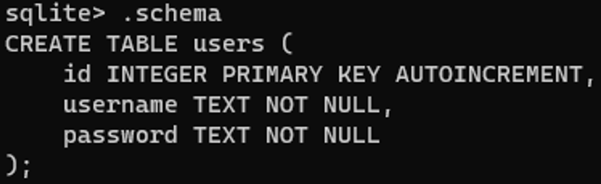

# 8-1_database : SQL 이란

<aside>
💡 author : 전재호(agamtt) 2023-12-20
contributor: 최우혁(choiwh1008) 2024-04-08

</aside>

## 하드코딩

우리의 index.php 는 이렇게 되어있었습니다.

아이디와 비밀번호가 코드에 포함되어 있습니다.

```bash
<?php

session_save_path('./');
session_start();

if ($_SERVER["REQUEST_METHOD"] == "POST") {

    $enteredUsername = $_POST["username"];
    $enteredPassword = $_POST["password"];

    $grapeUsername = "grape";
    $grapePassword = "secret1234";

    $baboUsername = "babo";
    $baboPassword = "babo1234";

    if ($enteredUsername == $grapeUsername && $enteredPassword == $grapePassword) {
        $_SESSION['user'] = "grape";
        header("Location: page-grape.php");
        exit();
    } elseif($enteredUsername == $baboUsername && $enteredPassword  == $baboPassword){
        $_SESSION['user'] = "babo";
        header("Location: page-babo.php");
        exit();
    } else {
        $errorMessage = "Invalid username or password";
    }
}
?>
```

코드에 직접 아이디와 패스워드가 들어있습니다.

```php
    $grapeUsername = "grape";
    $grapePassword = "secret1234";

    $baboUsername = "babo";
    $baboPassword = "babo1234";
```

이런 방식을 소프트웨어 개발에서, 하드코딩(Hard Coding) 이라고 부릅니다.

그러나… 이런식으로 코딩하면 안됩니다.

- 실제 사이트는 몇만개의 회원의 아이디와 비밀번호를 저장해야할 수도 있습니다.
- 하나의 회원이 여러개의 속성을 가질 수도 있습니다. (예를 들어 온라인게임의 경우, 레벨, 경험치, 소지한 아이템 …)

따라서 사이트에 대용량의 데이터를 저장할 경우, 이런식으로 이를 코드에 직접 적어서는 안됩니다.

이를 “하드코딩”이라고 부릅니다. (앞으로 코딩을 하다보면 하드코딩하지 말라는 말을 자주 듣게 될 것입니다.)

몇만개, 몇백만개, 몇억개의 데이터를 컴퓨터에 저장하려면 고-급 기술들이 필요합니다. (정렬, 탐색 등…)

현업에서 웹을 개발할때에는 이런 고급 기술이 이미 적용되어 개발된 프로그램을 사용합니다.

이러한 프로그램을 **데이터베이스** 라고 부릅니다.

보통 줄여서 디비(DB, DataBase) 라고 부릅니다.

고양이 홈페이지의 데이터베이스를 만들어 봅시다. 데이터베이스는 코드로 작동하는 엄청 큰 **엑셀**이라고 생각하면 됩니다. 

## 데이터베이스

- 데이터베이스는 “프로그래밍 언어로 작동하는 거대한 엑셀 비슷한 것” 입니다.
- 현대 사회에서 디지털로 작동하는 대부분의 데이터는 데이터베이스시스템에 저장됩니다.

## SQL

- SQL 은 데이터베이스에서 사용되는 프로그래밍 언어입니다.
- Python 언어를 사용하려면 Python 이 설치되어있어야하고, PHP 를 사용하려면 php가 설치되어있어야하는 것처럼, 어떤 프로그램이나 코드를 실행하려고 할때 설치되어있어야 하는 프로그램을 런타임(runtime) 이라고 부릅니다.
- SQL 을 사용하려면 sql 런타임이 설치되어 있어야합니다.

# 데이터베이스 아주 간단한 이론

<aside>
💡 데이터베이스는 컴퓨터공학과 전공 과목으로, 이거만 한 학기 내내 배웁니다.

</aside>

<aside>
💡 자세하게는 몰라도 되니, 명령어를 따라해보면서 확인만 하고 넘어갑시다.

</aside>

데이터베이스는 엑셀처럼 생겼습니다.

- 하나의 데이터베이스를 모아둔 것을 Table 이라고 부릅니다.
- 행을 Record 라고 부릅니다.
- 열을 Column 이라고 부릅니다.
    - 열의 이름을 Attribute(속성)이라고 부릅니다.

이는 엑셀이나 전화번호부를 상상하면 생각하기 쉽습니다.

- 전화번호부는 하나의 Table 입니다.
- 전화번호부에는 Attribute 로 이름,전화번호,이메일,그룹 등이 들어갑니다.
- 메이플스토리에는 Attribute 로 아이디,닉네임, 레벨, 아이템, 직업 등이 들어갑니다.

- 전화번호부에 새로운 사람을 추가하면 그 사람의 Record 가 Table 에 추가됩니다.
- 홍길동의 Record 는 (홍길동,23살,seoja@gmail.com) 입니다.


# 명령어 실습

<aside>
💡 실제 sql의 query문을 작성해보고, 데이터베이스가 작동하는 것을 확인해봅시다.

</aside>

sqlite3 를 사용하기 위해 sqlite3 런타임을 apt 로부터 설치합니다.

명령어는 아래와 같습니다.

```bash
sudo apt install -y sqlite3 php-sqlite3
```

cat_homepage라는 이름을 가진 db파일 생성해 봅시다.

```bash
touch cat_homepage.db
```

아래 명령어를 실행하면 sqlite3 로 cat_homepage.db 라는 db 파일을 엽니다.

```bash
sqlite3 cat_homepage.db
```

또는, sqlite3 인터프리터에서, `.open` 명령어로 db파일을 열 수도 있습니다.

```bash
# terminal에서...
sqlite3
# sqlite3 인터프리터에서...
.open cat_homepage.dbr
```

그리고, users라는 이름을 가진 table을 생성합시다. table을 만들기 위해서는 프로그래밍 언어에서 type 혹은 class에 해당하는 schema를 지정해주어야 합니다.

아래 명령어는 users 라는 테이블을 생성합니다.

```sql
CREATE TABLE users (
    id INTEGER PRIMARY KEY AUTOINCREMENT,
    username TEXT NOT NULL,
    password TEXT NOT NULL
);
```

위 내용은, users 테이블은 id, username, password라는 데이터로 이루어져있다는 뜻입니다.

table이 잘 생성되었는지 확인합시다.


users가 뜬다면 해당 table이 잘 만들어졌다는 뜻입니다.

한번, schema도 잘 지정되었는지 확인해봅시다.



그러면 이제, users라는 테이블에 (username, password)로 된 Record를 삽입합니다.

```sql
INSERT INTO users (username, password) VALUES ('grape', 'secret1234');
INSERT INTO users (username, password) VALUES ('alice', 'alice!@');
INSERT INTO users (username, password) VALUES ('babo', 'babo1234');
```

아래 명령어로 확인할 수 있습니다.

```sql
SELECT * FROM users;
```


**참고로 저런 모양으로 보기 위해서는, mode를 바꾸어주어야 합니다!**

```sql
.mode table
```

추가를 배웠으니, 삭제를 배워봅시다. alice라는 데이터셋을 지우기 위해서는…

```sql
DELETE FROM users WHERE username = 'alice';
```

다시 table을 확인해봅시다.


잘 삭제가 되었습니다!

모든 데이터를 table에서 지우기 위해서는 다음과 같은 명령어를 사용하면 됩니다.

```sql
DELETE FROM users;
```

다만, table 자체를 지우는 것은 아니고, 빈(empty) 상태로 만드는 것입니다.

기본적인 실습이 끝났으니, sqlite3 쉘에서 나갑시다.

```sql
.quit
```

그리고 cat_homepage.db 를 삭제합니다.

```bash
rm cat_homepage.db
```

계속